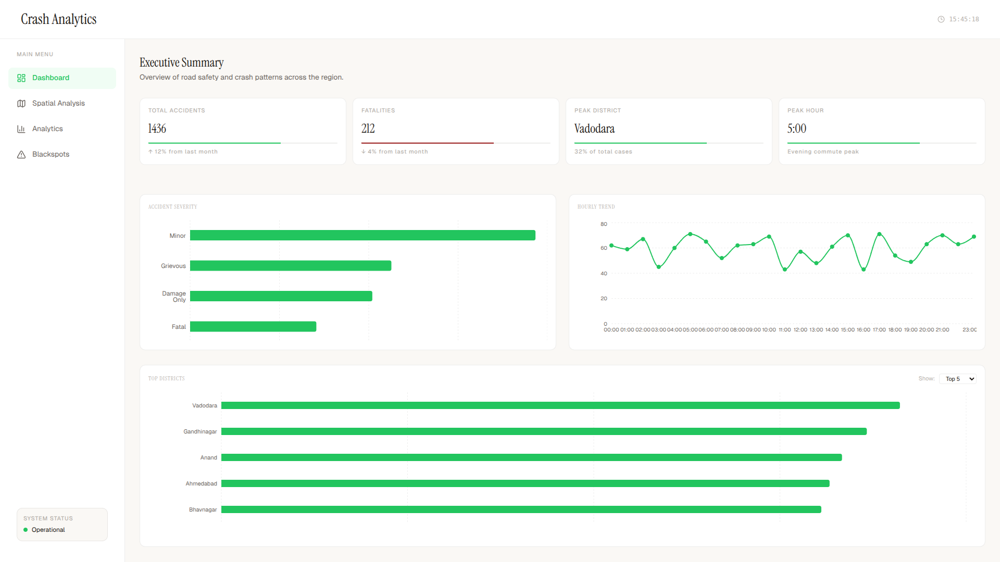
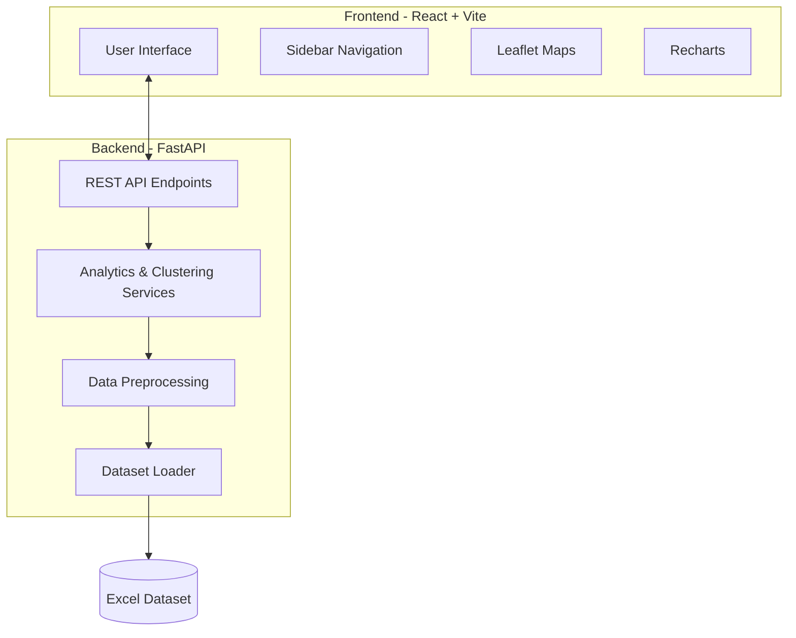

# Crash Analytics Dashboard and Blackspot Identification

## G-TRISP Internship Task – Group A2



This repository contains a full-stack crash data analytics dashboard developed for the G-TRISP internship evaluation task. The system analyzes road accident data to identify temporal trends, severity patterns, spatial distributions, and accident-prone blackspot regions using geospatial clustering techniques.

---

## 🏗️ Project Architecture



---

## 🎯 Objective

Develop a crash data analysis dashboard that is clear, readable, and easy to understand for non-technical users. The dashboard helps users identify important crash patterns, high-risk locations, and key safety insights from the dataset.

It includes:
- Data Cleaning
- Descriptive Analysis
- Crash Trend Analysis
- Spatial Analysis
- Kernel Density Estimation (KDE) / Heatmap
- DBSCAN Clustering
- Blackspot Identification

---

## 🏗️ System Architecture Details

The project is built using a modern decoupled architecture:

*   **Backend**: `FastAPI` (Python)
    *   Handles data loading, cleaning (handling missing values, datetime conversion).
    *   Performs mathematical aggregations using `pandas`.
    *   Executes `DBSCAN` clustering for blackspot identification.
    *   Serves data via REST API endpoints.
*   **Frontend**: `React.js` (Vite)
    *   Responsive, sidebar-navigated dashboard.
    *   Uses `Recharts` for analytical charts (trends, severity, distributions).
    *   Uses `react-leaflet` and `react-leaflet-heatmap-layer-v3` for interactive spatial maps.

---

## 📊 Dashboard Features

1.  **Dashboard (Executive Summary)**:
    *   Key Performance Indicators (KPIs)
    *   Severity Distribution (Bar Chart)
    *   Hourly Accident Trend (Line Chart)
    *   Top Districts Filterable View (Horizontal Bar Chart)
2.  **Spatial Analysis Suite**:
    *   **Accident Point Distribution**: Raw spatial mapping of individual accidents.
    *   **Accident Density Heatmap**: Visual KDE intensity mapping of crash hotspots.
    *   **DBSCAN Identified Clusters**: Visual representation of the mathematically calculated blackspot clusters (500m radius).
3.  **Advanced Analytics**:
    *   Road Classification Distribution
    *   Weather Condition Distribution
    *   Collision Type Breakdown
    *   Traffic Violation Analysis
4.  **Blackspots**:
    *   A detailed table listing identified clusters, total accidents, fatalities, and a weighted Severity Score.

---

## 🚀 How to Run the Dashboard

To run the dashboard locally, you will need to start both the Python backend and the Node.js frontend.

### 1. Start the Backend (FastAPI)
The backend requires Python 3.8+.

```bash
cd backend
# Create a virtual environment (optional but recommended)
python3 -m venv .venv
source .venv/bin/activate

# Install dependencies
pip install -r requirements.txt
pip install fastapi uvicorn pandas numpy scikit-learn

# Run the server
uvicorn app.main:app --reload --port 8000
```
*The backend API will run at `http://localhost:8000`*

### 2. Start the Frontend (React)
The frontend requires Node.js and npm.

```bash
cd frontend

# Install dependencies
npm install

# Start the development server
npm run dev
```
*The frontend dashboard will typically run at `http://localhost:5173` (check the terminal output for the exact local link).*

---

## 🧠 Methodology Details

*   **DBSCAN Clustering**: The backend uses Scikit-learn's DBSCAN with the `haversine` metric on radian coordinates to accurately measure earth-surface distances. The parameters used are a 500-meter search radius (`eps`) and a minimum of 5 accidents (`min_samples`) to qualify as a cluster.
*   **Blackspot Scoring**: Clusters are ranked by a weighted severity score: `(Fatal * 5) + (Grievous * 3) + (Minor * 1)`.
*   **KDE / Heatmap**: Rendered dynamically on the frontend map using coordinate weights to visually highlight density.
